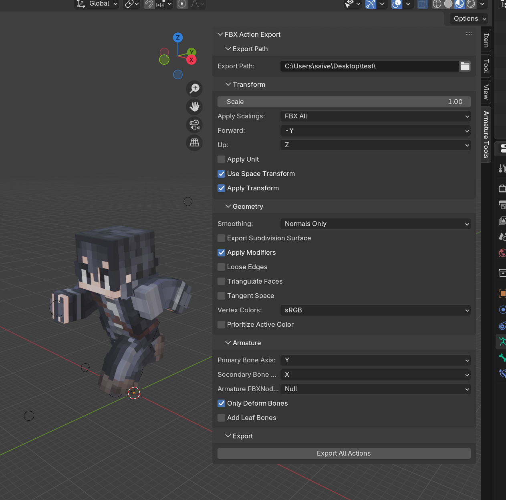

# 🛠️ FBX Action Exporter for Blender

This Blender add-on streamlines the process of exporting all animation actions (NLA tracks) as individual `.fbx` files. It's particularly useful for game developers and animators working with engines like Roblox, Unreal Engine, or Unity.

---

## ✨ Features

- **Batch Export Animations**: Automatically exports each action as a separate `.fbx` file.
- **Customizable Export Settings**: Adjust transform, geometry, and armature options to fit your project's needs.
- **User-Friendly Interface**: Integrates seamlessly into Blender's UI with collapsible panels for organized settings.
- **Game Engine Compatibility**: Ensures exported files are ready for use in various game engines, including Roblox and Unreal Engine.

---

## 🎮 Use Cases

- **Roblox Development**: Ideal for exporting character animations for custom avatars.
- **Unreal Engine Projects**: Simplifies the process of importing animations into UE5.
- **Unity Integration**: Facilitates the export of animations for Unity-based games.
- **General Game Development**: A valuable tool for any project requiring organized animation exports.

---

## 📦 Installation

### 🧩 From GitHub

1. Clone or download this repository:
   ```bash
   git clone https://github.com/your-username/fbx-action-exporter.git
   ```
2. Open Blender.
3. Go to `Edit > Preferences > Add-ons > Install...`
4. Navigate to the `fbx_action_exporter.py` file in the cloned repo.
5. Click "Install Add-on".
6. Enable the add-on.
7. You'll find the panel in `View3D > Sidebar > Armature Tools`.

---

## 🚀 Getting Started

1. Set your desired export path in the add-on panel.
2. Configure the export settings to match your project's requirements.
3. Click the `Export All Actions` button to generate `.fbx` files for each animation.

---

## 📸 Preview



---

## 📄 License

This project is licensed under the MIT License. See the [LICENSE](link_to_license) file for details.

---

Enhance your animation export workflow with this efficient and customizable Blender add-on! 🎬

